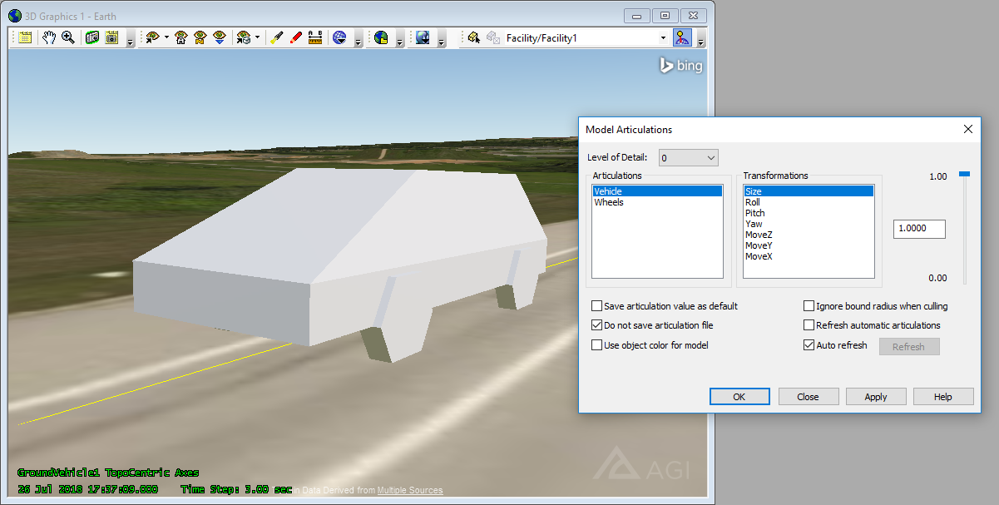
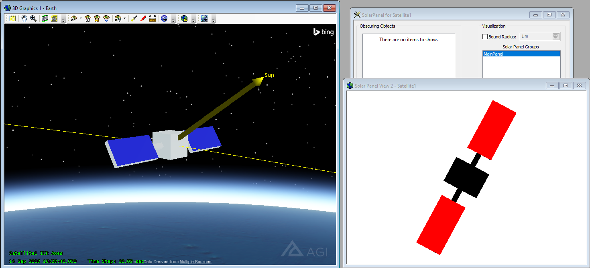
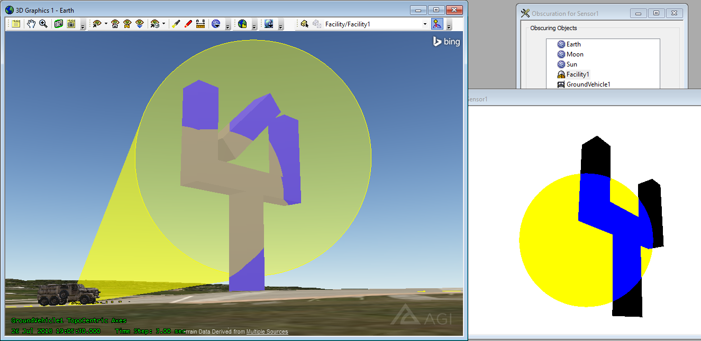

# GMDF Samples

Each sample here has a folder named `separate-metadata` where a `*.gmdf` file is placed alongside a sample `*.gltf` (JSON text) and `*.glb` (binary) file.  The glTF/GLB files are stock, containing no AGI-specific metadata, and the GMDF file supplies this data.

Each sample has another folder named `embedded-metadata` where no `*.gmdf` file is present, and the metadata has been embedded into both the `*.gltf` and `*.glb` file using the `AGI_articulations` and/or `AGI_stk_metadata` extensions as needed within those files.

## VehicleTest

This example shows the basic Move, Yaw/Pitch/Roll, and Scale articulations applied to a boxy stand-in for a ground vehicle.  It also demonstrates a `Wheels` articulation that applies to multiple glTF nodes (the front wheels and the back wheels) simultaneously.

## SolarPowerTest

This example shows metadata annotations for the Solar Power Tool.  It also contains an attach point, a panel rotation articulation, and a pointing vector for Sun-facing panels.

## ObscurationTest

This example shows a section of a model that has been marked as not obscuring a sensor view.  For this simple test, the model is shaped like a 2-prong fork with a diagonal slash through the middle of it.  This diagonal portion has been marked with `noObscuration` and will not appear in the STK Sensor Obscuration Tool calculations.

